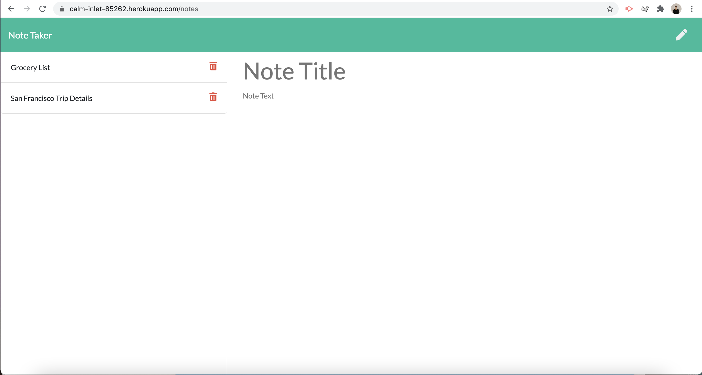

# Note Taker

## Project Description

This project is a note taking app which lets a user create notes, store them, retrieve them at a later time, and delete them.

## Project Screenshot  

 
## Link to Deployed Project  

https://calm-inlet-85262.herokuapp.com/notes

## Background

I live by my notes. I write just about everything down in my work and personal life. I love just being able ot pull up my phone and have all my reminders and notes saved in there.

## Challenges

It was challenging to figure out how to assign each note a unique id so that individual notes could be deleted at a later time.

## Learnings

Throughout this project I became more comfortable with deploying to Heroku, creating server requests and working with middleware.

## Usage

When the app loads, the user is prompted to create a new note. When they type in a note and save it, it will get stored with any other entered notes on the left side of the page. If the user had previously entered notes, they would also appear on the left side.

## Credits

Thank you to Columbia's Full-Stack Web Developer bootcamp for all the assistance and for teaching me all that I have learned.

## Licence

Copyright (c) 2021 Steven Stefanov

Permission is hereby granted, free of charge, to any person obtaining a copy
of this software and associated documentation files (the "Software"), to deal
in the Software without restriction, including without limitation the rights
to use, copy, modify, merge, publish, distribute, sublicense, and/or sell
copies of the Software, and to permit persons to whom the Software is
furnished to do so, subject to the following conditions:

The above copyright notice and this permission notice shall be included in all
copies or substantial portions of the Software.

THE SOFTWARE IS PROVIDED "AS IS", WITHOUT WARRANTY OF ANY KIND, EXPRESS OR
IMPLIED, INCLUDING BUT NOT LIMITED TO THE WARRANTIES OF MERCHANTABILITY,
FITNESS FOR A PARTICULAR PURPOSE AND NONINFRINGEMENT. IN NO EVENT SHALL THE
AUTHORS OR COPYRIGHT HOLDERS BE LIABLE FOR ANY CLAIM, DAMAGES OR OTHER
LIABILITY, WHETHER IN AN ACTION OF CONTRACT, TORT OR OTHERWISE, ARISING FROM,
OUT OF OR IN CONNECTION WITH THE SOFTWARE OR THE USE OR OTHER DEALINGS IN THE
SOFTWARE.